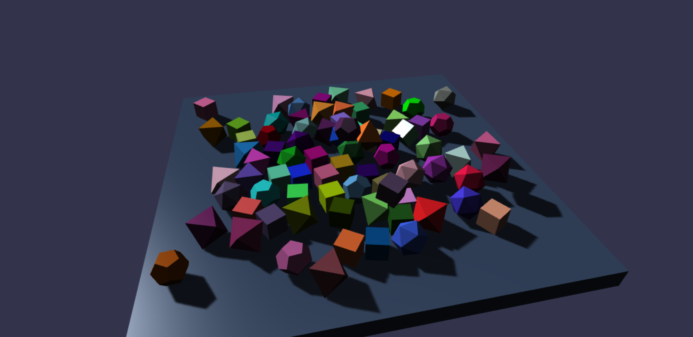
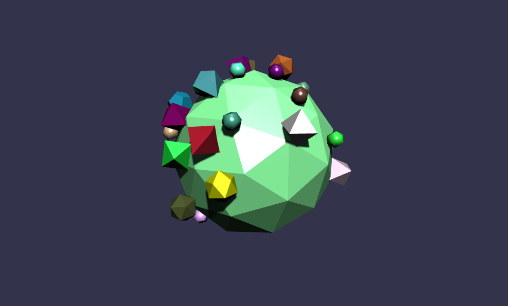
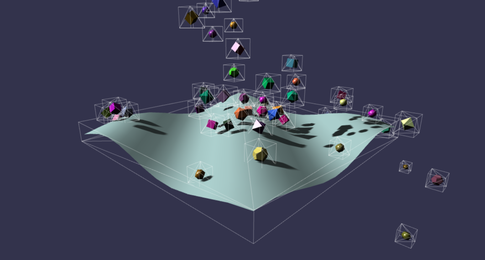
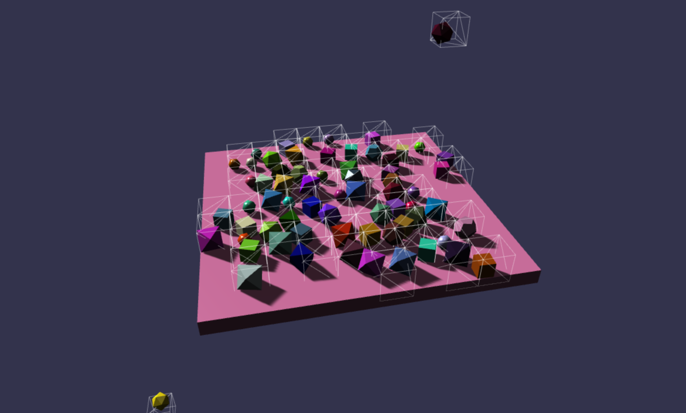
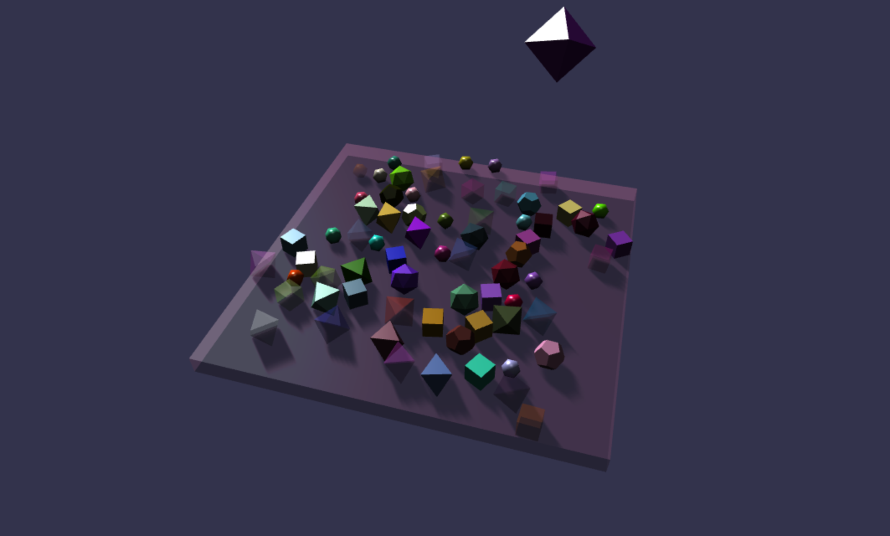
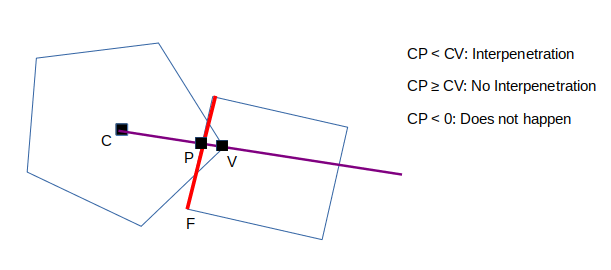
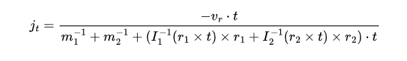

# The Avalanche Engine

By Barthélemy Paléologue

## Introduction

For the past month, I have been working on rigidbody physics for my final project. More precisely, I worked on non-penetration constraints, which are used to prevent rigidbodies from intersecting. My goal was to create a fast and accurate physics engine, which could then be used in my other projects. One of the constraints I added myself is working with both convex and concave shapes such as terrain, because I want to use the engine for procedural planets which are made of concave terrain.

## The Source Code

The project has been built using WebGL, therefore online demos are available:

The official repo: [https://github.com/BarthPaleologue/Avalanche](https://github.com/BarthPaleologue/Avalanche)

Simple demo: [https://barthpaleologue.github.io/Avalanche/dist/](https://barthpaleologue.github.io/Avalanche/dist/)

Demo terrain: [https://barthpaleologue.github.io/Avalanche/dist/nofriction.html](https://barthpaleologue.github.io/Avalanche/dist/nofriction.html)

Dynamic geometry: [https://barthpaleologue.github.io/Avalanche/dist/carpet.html](https://barthpaleologue.github.io/Avalanche/dist/carpet.html)

Small planet: [https://barthpaleologue.github.io/Avalanche/dist/planeta.html](https://barthpaleologue.github.io/Avalanche/dist/planeta.html)

Finally, there is a video of the engine in action: [Video](https://youtu.be/glrhWh6qJqw)

There is a small UI that allows to display bounding boxes, contact points, the hash grid, resting bodies and wireframes. You can click on bodies to apply an impulse to them.

The dependencies are quite heavy (the burden of webgl) so they are not included in the repo.
To run the code on your machine you must have Node.js installed. Then run the following commands:

    npm install
    npm run serve:prod

If you modify the code, you can run on development mode by running:

    npm run serve

There will be overhead so you can run it on the production server by running:

    npm run build
    npm run serve:prod

The code of the engine is in the `src/ts` folder. You will find the important files `engine.ts` and 
`rigidbody.ts`. The other files are either called by them or are just used for the demos. The intersection code is in `src/ts/utils/intersection.ts`.

## The Physics Engine

### Rigidbody motion

The motions of the bodies are based on what we have done in TP with Euler integration. I use quaternions for rotations.

I added Force fields to alter the motion of the bodies in a continuous way (gravity for example).
There is a uniformly directional force field, and a point force field to emulate what we experience on the ground and in space.

The last thing I added is inertia tensor calculation. I found a formula on the internet for the inertia tensor of a triangle in 3D space. I then used this formula to compute the inertia tensor of any mesh. It seems to work with an exact x10 error (compared with the cube and the cylinder). Therefore I divided by 10, but I think there is more to do to make this formula truly work.

### Collision detection: Broad phase

The collision detection system proposed by David is in two phases. First we perform a broad phase that is fast and imprecise to detect all the bodies that might be intersecting.

#### AABBs

The paper describes how Axis Aligned Bounding Boxes work in great length, therefore I chosed to implement this phase using AABBs. Computing the intersection of 2 AABBs is very fast, and one nice property is that their overlap is another AABB.

Each body is given 2 AABBs, one for the current state, and one for the next state that is being computed multiple times in the narrow phase. 

Sometimes, you can get very close contact without any AABB intersection. To avoid this, I add an epsilon-offset to the AABBs to catch more collisions early on. It allows for faster moving objects without interpenetration.

#### Infinite Spatial Hash Grid

To avoid testing all AABBs against each other, I chose a data-structure that allows me to reduce the number of comparisons. I could have used a regular grid, but we would be confined to a finite space. On the other hand, octrees give dynamic resolution and are interseting but still we are confined to finite space. Yes I hate finite space. That is why I chose to use an infinite spatial hash grid to overcome this limitation. Yet I have to deal with a static resolution.

The grid is rebuilt at each update and each cell contains a list of all the bodies inside of it. During the broad phase I then just have to check the cell the body is in and the adjacent cells. This is a very fast operation, and it allows me to quickly find which bodies may be colliding.

#### Rest Detection

Improving the complexity of the broad phase is not everything, the goal is to eliminate as many meaningless contacts as possible. Maybe two bodies have their AABBs intersecting, but they are resting on the ground and not colliding. It would be faster if we could detect this and avoid computing the expensive narrow phase in that case.

I use different methods to achieve this. First, a body at rest must have minimal linear speed and angular speed. For this we can use a simple threshold. But it is not enough, because a body could be colliding in a way that it negate all its speed before slowly falling on the ground. 

It makes sense that the velocity of the body should then be decreasing in the last frames for it to be resting. I use a vector queue to store the last velocities of the body. I then compute the variance of the velocities: if it is low, then the body is either resting or freefalling. If the variance is high, then the body has a changing velocity, hinting at collisions.

To prevent considering freefalling objects as resting, I also check that the body is intersecting with at least one other body. If it is not, then it is freefalling and not resting.

The last thing to consider are the neighboring bodies. If the neighbors are not resting, then the body might be colliding with them. I use the same method as above to check if the neighbors are resting. This creates some instability, but the speedup is worth it.

Using the spatial hash grid and the rest detection, I can reach 100 bodies at 60fps on my potatoe laptop.

### Collision detection: Narrow phase

Now that we have a list of bodies that may be colliding, we have to check if they are actually colliding. This is the narrow phase. If I was only deadling with convex shapes, I could use the GJK algorithm. But I also want to deal with concave shapes, so I have to use a different algorithm, more general. (See the terrain demo where the terrain is concave)

#### Vertex to Face

What I use is vertex to face collision detection. I consider the ray coming from the center of mass of one body going to its vertex and I consider the intersection with the triangles of the other body:

By doing this, I can detect collisions between convex and concave shapes. It gives us a nice way to compute the penetration distance.

Then according to the paper, we use bisection to go back to the instant of collision by recomputing the next step for different time steps. It is quite fast and limiting the number of iterations of the bisection to 7 gives a good accuracy.

If bisection cannot converge, I push the bodies apart using a hard translation that prevents any interpenetration. This is not ideal, but it is better than having bodies stuck together.

Then we can use the previous method to compute the contact point and the normal. 
We can then try to resolve the collision.

#### Edge to Edge

I started to work on edge to edge collisions but it was really slow and imprecise. In the end I decided to not use it as I would have needed more time.

### Collision resolution

We use the impulse method to resolve the collision using the huge formula derived in the paper. We can handle static bodies by setting the inverse mass and inverse inertia tensor to zero. The impulse are then applied to the next step and applied to the bodies. Each body comes with a restitution coefficient that determines how much energy is lost in the collision.

Instead of using the resting contacts of the paper, I chose to use friction impulses with my rest detection mechanism I described earlier.

Friction impulses are based on the Coulomb friction model, which is a good approximation for most materials and allows finer control using a per-body friction coefficient.

This approach is very fast, contrary to what was proposed in the paper. The main limitation is that using only vertex to face collisions, the bodies can experience instability and oscillate. The rest detection can mitigate this issue a little, but shapes with many polygons such as the Stanford bunny will still experience instability.

Another solution would be to use colliders independent from the mesh geometry. This would allow to have more stable and faster collisions, but it would be more complex to implement.

## References

Non-penetration constraints: [https://www.cs.cmu.edu/~baraff/sigcourse/notesd2.pdf](https://www.cs.cmu.edu/~baraff/sigcourse/notesd2.pdf)

GJK algorithm: [https://cse442-17f.github.io/Gilbert-Johnson-Keerthi-Distance-Algorithm/](https://cse442-17f.github.io/Gilbert-Johnson-Keerthi-Distance-Algorithm/)

GJK algorithm: [https://www.youtube.com/watch?v=MDusDn8oTSE&t=322s](https://www.youtube.com/watch?v=MDusDn8oTSE&t=322s)

Vertex to Face collision detection: [https://www.youtube.com/watch?v=qdBLJljSqys](https://www.youtube.com/watch?v=qdBLJljSqys)

Friction Impulse: [https://gafferongames.com/post/collision_response_and_coulomb_friction/](https://gafferongames.com/post/collision_response_and_coulomb_friction/)

Finding inertia tensor of a 3d triangle: [https://web.archive.org/web/20161229044620/https://en.wikipedia.org/wiki/Inertia_tensor_of_triangle](https://web.archive.org/web/20161229044620/https://en.wikipedia.org/wiki/Inertia_tensor_of_triangle)

Finding inertia tensors for arbitrary polyhedra: [https://citeseerx.ist.psu.edu/viewdoc/download?doi=10.1.1.56.127&rep=rep1&type=pdf](https://citeseerx.ist.psu.edu/viewdoc/download?doi=10.1.1.56.127&rep=rep1&type=pdf)

Spatial Hash Grids: [https://www.youtube.com/watch?v=sx4IIQL0x7c](https://www.youtube.com/watch?v=sx4IIQL0x7c)